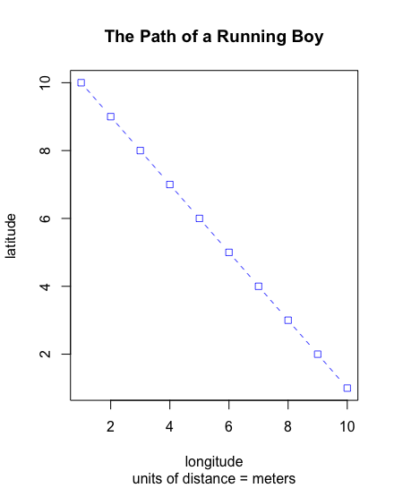
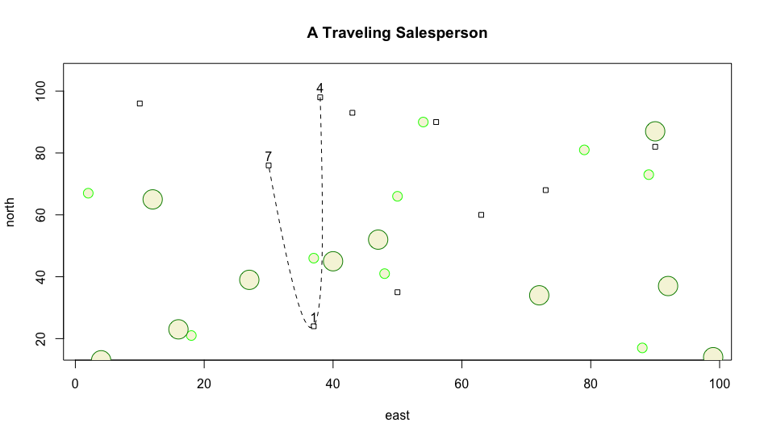
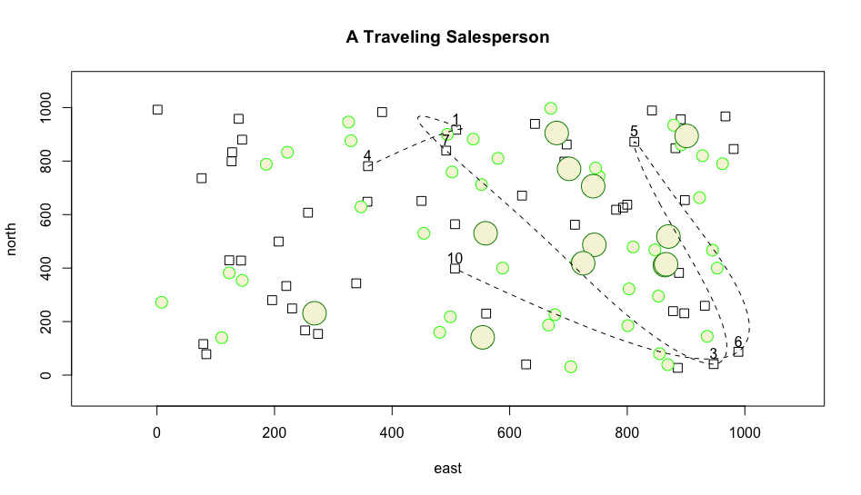

# Getting Started with R & RStudio

### Date: 8/24/2020

## Path of the Running Boy
First, I created a path of the running boy by plotting x against y with a negative slope as seen below. 

```
x <- 1:10
y <- 10:1
plot(x, y, type = "b", main = "The Path of a Running Boy", 
     sub = "units of distance = meters", 
     xlab = "longitude", 
     ylab = "latitude",
     lty = 2,
     lwd = .75,
     col = "blue",
     pch = 0,
     cex = 1)
```



## A Traveling Salesperson
Next I learned about random samply in R and plotted 10 dwellings, 10 small trees, 10 large trees, and created a labeled path between three houses using a dashed spline.

```
# Initialize x & y
x <- 1:100
y <- 1:100

# Randomy select from x & y and replace result
east <- sample(x, size = 10, replace = TRUE)
north <- sample(y, size = 10, replace = TRUE)

# Repeat length of each square 0.75 ten times or once per square
symbols(east, north, squares = rep(.75,10), inches = FALSE)

# 10 small trees
symbols(sample(x, 10, replace = TRUE), 
        sample(y, 10, replace = TRUE), 
        circles = rep(.75,10), 
        inches = FALSE,
        fg = "green1",
        bg = "beige",
        add = TRUE)

# 10 large trees
symbols(sample(x, 10, replace = TRUE), 
        sample(y, 10, replace = TRUE), 
        circles = rep(1.5,10), 
        inches = FALSE,
        fg = "green4",
        bg = "beige",
        add = TRUE)

# Create a data frame
dwellings <- cbind.data.frame(id = 1:10, east, north)

# Sample 3 dwellings along our path
locs <- sample(1:10, 3, replace = FALSE)

# lines(x = dwellings[locs, 2], # Easterly coordinate
#       y = dwellings[locs, 3], # Northernly coordinate
#       lty = 2,
#       lwd = .75,
#       col = "blue")
# Annotate all houses
# text(x = dwellings$east,
#      y = dwellings$north+3,
#      labels = dwellings$id)

# Only annotate houses we visit
text(x = dwellings[locs, ]$east, 
     y = dwellings[locs, ]$north + 3,
     labels = dwellings[locs, ]$id)

# Make the walking path more realistic
xspline(x = dwellings[locs, 2], # Easterly coordinate
        y = dwellings[locs, 3], # Northernly coordinate
        shape = -1,
        lty = 2)

# Add a title to the plot
title(main="A Traveling Salesperson")
```



## A Traveling Salesperson (Challenge Problem)


