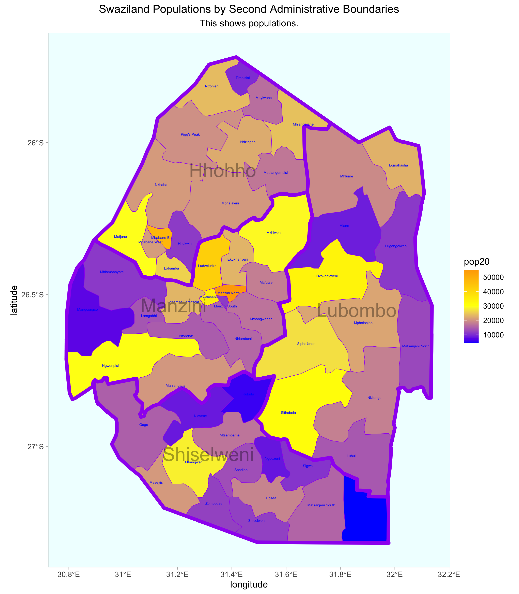

# Population Data for Swaziland

### Date: 8/26/2020

## Assignment
For this plot I found the population of the the first administrative subdivisions and colored them accordingly. Yellow corresponds to low population and red corresponds to high populatio

## Individual Stretch Goal 1
For this plot I found the population of the the second administrative subdivisions and colored them accordingly.

## Individual Stretch Goal 2
Here I recolored the map to make it more distinct and apply skills learned in the previous assignment related to setting alpha values. 

[Here](scripts/spatialDataPracticeSwaziland.R) is the code.
