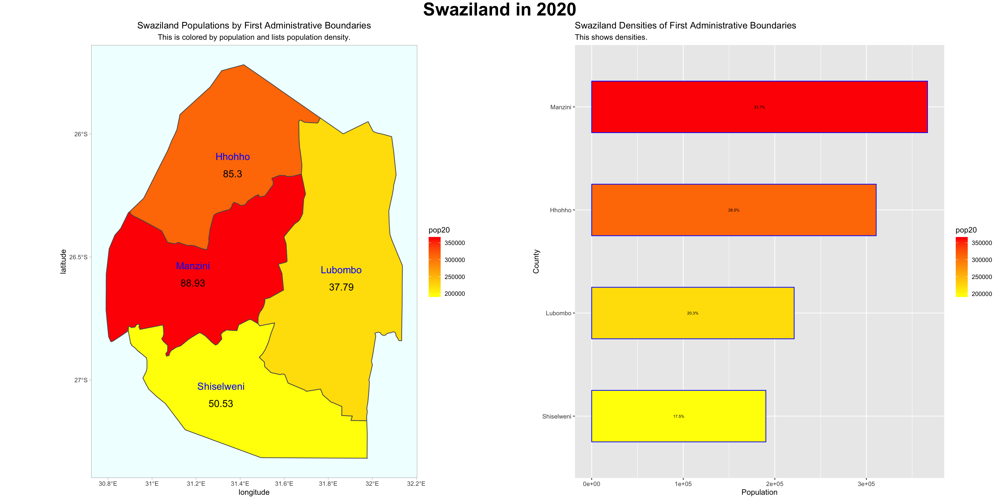
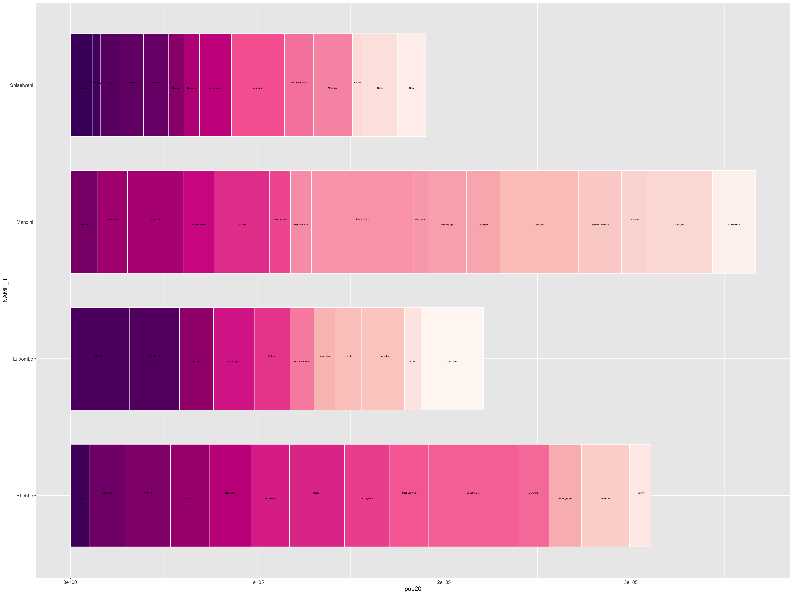
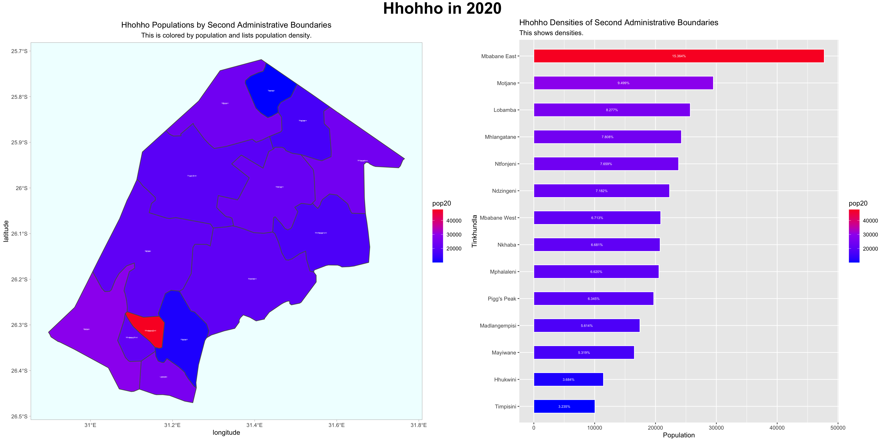

# Part 1.a: Population Data for Swaziland

### Date: 8/31/2020

[Go to Summary](project1summary.md)  
[Go to Part 1.b.](project1.md)  

## Assignment
For this plot I created a bar plot of the population of each first level subdivision as a part of the overall population and added the population density under each subdivision 1 title on the map. 

## Individual Stretch Goal 1
In this plot I created a bar plot showing the proportion of each secondary subdivision as a part of the first-level subdivisions. Then each first-level subdivision is shown as a proportion of overall population, as indicated by the length of each bar.

## Challenge 
In this plot I repeated the original assignment but only looked at one region in Swaziland: Hhohho.

[Here](scripts/barGraph.R) is the code.
