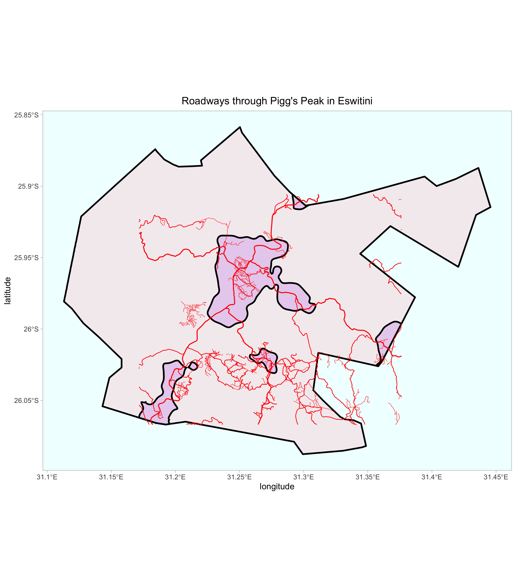

# DHS Data: Individual and Household

### Date: 10/2/2020

## Project Statement
Here is the project statement I submitted to DHS to access the individual and household data.
```
I am in an agent-based modeling class researching development factors in a LMIC,
in this case Eswatini. Our current project is to generate a synthetic population
using household and individual data. In our first project we dispersed population
based on raster data from WorldPop, and now we want to group our "agents" into
households. The purpose of this research is to accurately describe the agents at
work regarding human development.
```

## The data
I then downloaded the stata datasets for Individual recode and Household recode, and read them into R using `Haven`. The household data has 4293 variables and the individual 4217 variables. Here are some notable variables from the household data:
- `hv009`: number of household members
- `hv104_01` to `hv104_34`: sex of household members
- `hv105_01` to `hv105_34`: age of household members
- `hv024`: adm1 labels and data

With these variables in mind, I created a new data fram called `dhs_vars` that is a subset of the columns of `dhs_household` with the following command:
```dhs_vars <- dhs_household %>% dplyr::select(hv005, hv009, hv024, hv104_01:hv104_34, hv105_01:hv105_34)```





