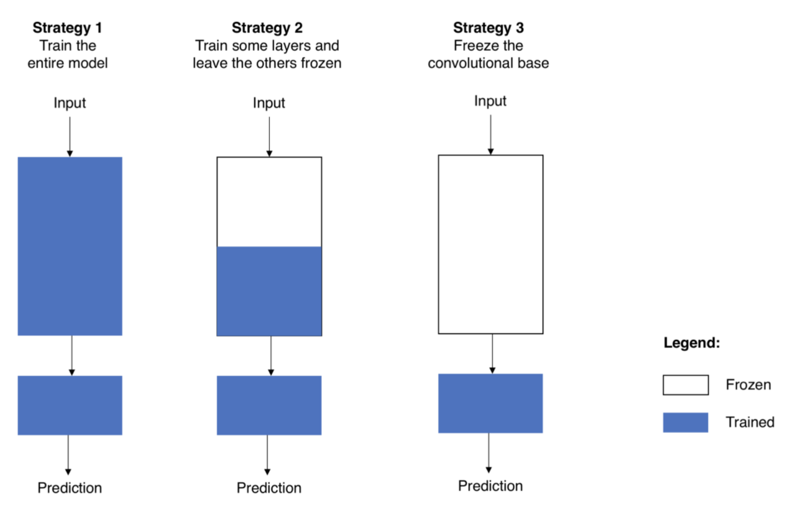
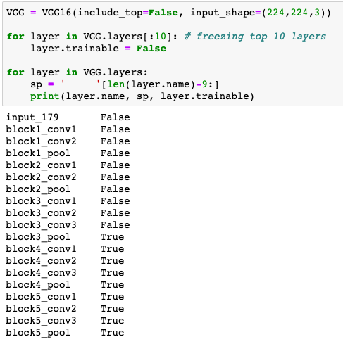

# Insight I: Transfer Learning
### September 18, 2020

## Overview
Image classification is one of the essential purposes of deep learning. However, often this process can take a long time, so one method to improve models that perform image classification is through transfer learning.

Transfer learning allows data scientists to build better deep learning models faster because we use pretrained models to initialize our weights, instead of setting weights randomly. This usually leads to better models that can be trained more quickly.

## Definitions 
- Neural Network: Algorithms to find relationships in data similar to how the human brain digests data.
- Convolution Neural Network (CNN): deep learning models used for image detection and classification; belong to the field of computer vision.
- Classifier: The final level of a CNN that places our images into a specific class (i.e. classify pictures of animals as cats and dogs).
- Keras: Python neural-network library.
- Pre-trained model: A neural network model that was already trained (and accurate) for a problem similar to the one we want to solve. A complete list of Keras pre-trained models can be found [here](https://keras.io/api/applications/). We usually want to choose a model trained on a similar dataset. FOr instance, ImageNet is a good choice for dog images but no cancer cell images. Here is an excerpt of examples:
  - ResNet50
  - VGG16
  - MobileNet
- Transfer Learning: Using pretrained models to classify images faster and better.


## Transfer Learning

#### Process Overview
When we add a pre-trained model, we have to follow these steps to conform the model to our dataset.

1. Remove the classifier and add your own.
2. Conform the model to your specific needs via freezing choices. How much we freeze depends on the similarity of our task to the pretrained model and the size of our dataset:
 - If your new dataset is very different from the data set the pre-trained model was trained on, freeze nothing. We need lots of data to generate new weights, though.
 - If your dataset is similar, freeze some layers (i.e. don’t allow these weights to be adjusted) and unfreeze others.
 - If your dataset is small or the pre-trained model solves a very similar problem to your freeze all the layers.



### Freezing
But what is freezing? A CNN is made up on many layers with many attached weights that determine how our image is interpreted. We want the best weights that give us the most accurate model of our dataset without overfitting. Therefore, we have to make choices of how much of the pretrained model we decide to use. 

When deciding which layers to freeze, data scientisits choose to freeze "lower" levels (closer to the input), because these layers are more general. In contrast, the "higher" levels are closer to the classification step, so we would be more likely to leave them unfrozen.

Just to be clear about definitions, a small dataset is one that typically has less than 1000 images per class. 

## Code
Here is an R implementation of the pretrained model `VGG16` that I think sums up the variables we can choose well:
```
tf.keras.applications.VGG16(
    include_top=True,
    weights="imagenet",
    input_tensor=None,
    input_shape=None,
    pooling=None,
    classes=1000,
    classifier_activation="softmax",
)
```

And from this [source](https://keras.io/api/applications/vgg/#vgg16-function) we get definitions of each argument.
```
Arguments

include_top: whether to include the 3 fully-connected layers at the top of the network.
weights: one of None (random initialization), 'imagenet' (pre-training on ImageNet), or the path to the weights file to be loaded.
input_tensor: optional Keras tensor (i.e. output of layers.Input()) to use as image input for the model.
input_shape: optional shape tuple, only to be specified if include_top is False (otherwise the input shape has to be (224, 224, 3) (with channels_last data format) or (3, 224, 224) (with channels_first data format). It should have exactly 3 input channels, and width and height should be no smaller than 32. E.g. (200, 200, 3) would be one valid value.
pooling: Optional pooling mode for feature extraction when include_top is False. - None means that the output of the model will be the 4D tensor output of the last convolutional block. - avg means that global average pooling will be applied to the output of the last convolutional block, and thus the output of the model will be a 2D tensor. - max means that global max pooling will be applied.
classes: optional number of classes to classify images into, only to be specified if include_top is True, and if no weights argument is specified.
classifier_activation: A str or callable. The activation function to use on the "top" layer. Ignored unless include_top=True. Set classifier_activation=None to return the logits of the "top" layer.
```

Finally, here is a Python implementation where we freeze the top 10 layers of a model implementing a VGG16 pre-trained model:
```
VGG = VGG16(include_top=False, input_shape=(244,244,3))

for layer in VGG.layers[:10]: # freezing top 10 layers
  layer.trainable = False
 
for layer in VGG.layers:
  sp = '     '[len(layer.name)-9]
  print(layer.name, sp, layer.trainable)
```
And here is the output:


## Purpose
Why care about image classification in human development? 

#### Road Quality
One application is already being investigated on campus in the GeoLab regarding road quality. Thanks to the prevalence of satellite images, it is easier than ever to visualize roads in low middle income countries (LMIC). Pairing this data with vibration data from an Android phone app, we are able to train a model that can predict road quality. The satellite data is often open source, and most people have phones, so this is a relatively inexpensive method to assess road quality.

#### Tracking Human Development in India
In LMICs, accurate settlement and household data is uncommon mostly because it is expensive and requires a concerted government effort. Thus, data scientists want to build models that can circumvent these issues and generate more accurate settlement data. In an article in the Medium, Adhya Dagar describes just this. In Dagar's example, researchers used a convolutional neural network and transfer learning in order to predict socioeconomic levels of different settlments (i.e. villages) by taking into account different indicators:
- Assets
- Bathroom facilities
- Condition of households
- Fuel for cooking
- Main source of light
- Main source of water
- Literacy


## References
1. https://towardsdatascience.com/step-by-step-guide-to-using-pretrained-models-in-keras-c9097b647b29
2. https://towardsdatascience.com/an-approach-to-tracking-human-development-through-satellite-imagery-in-india-7e750b85dc90
3. https://towardsdatascience.com/transfer-learning-from-pre-trained-models-f2393f124751
4. https://towardsdatascience.com/building-a-convolutional-neural-network-cnn-in-keras-329fbbadc5f5
5. https://keras.io/api/applications/
