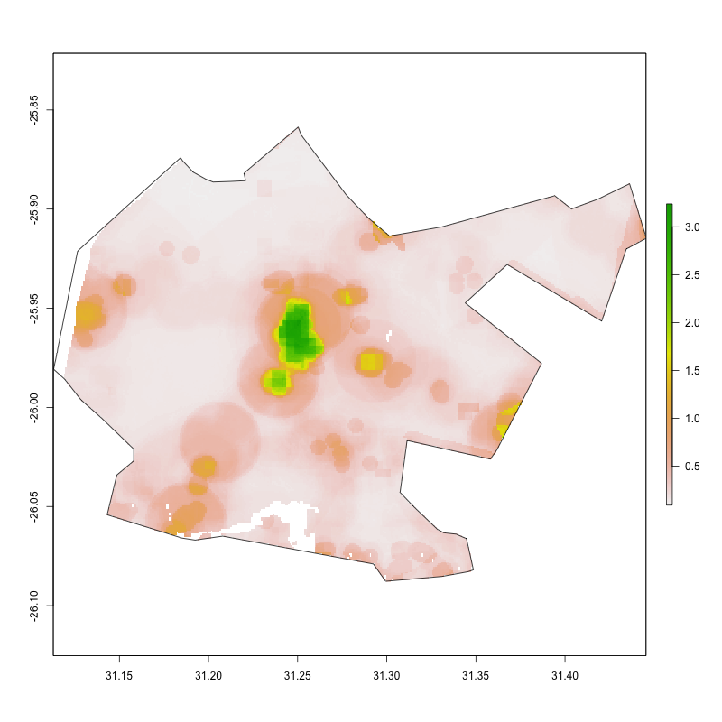
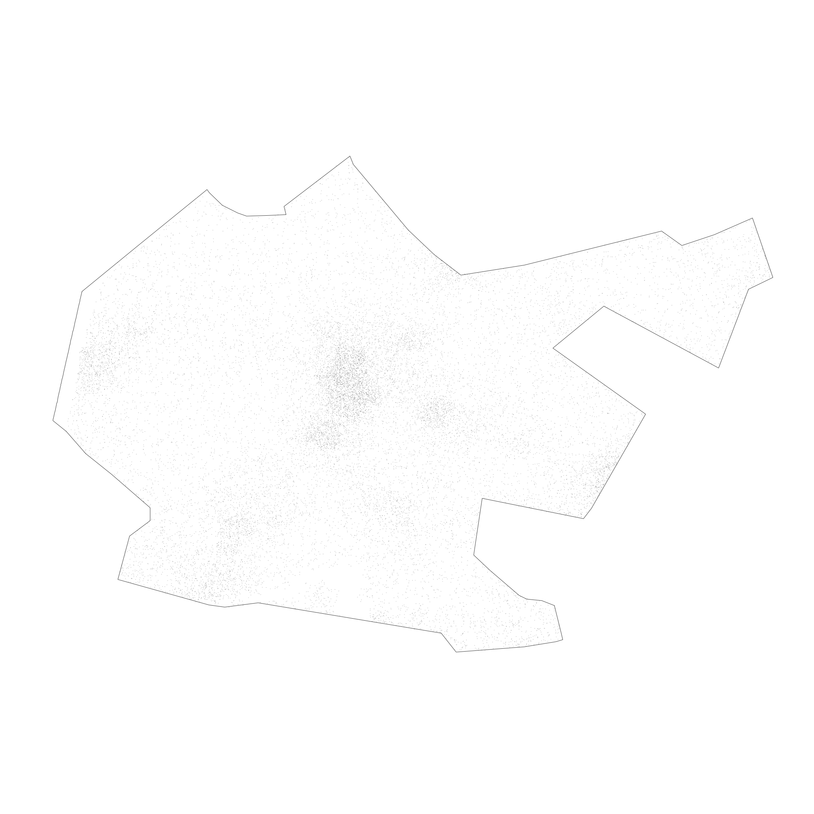
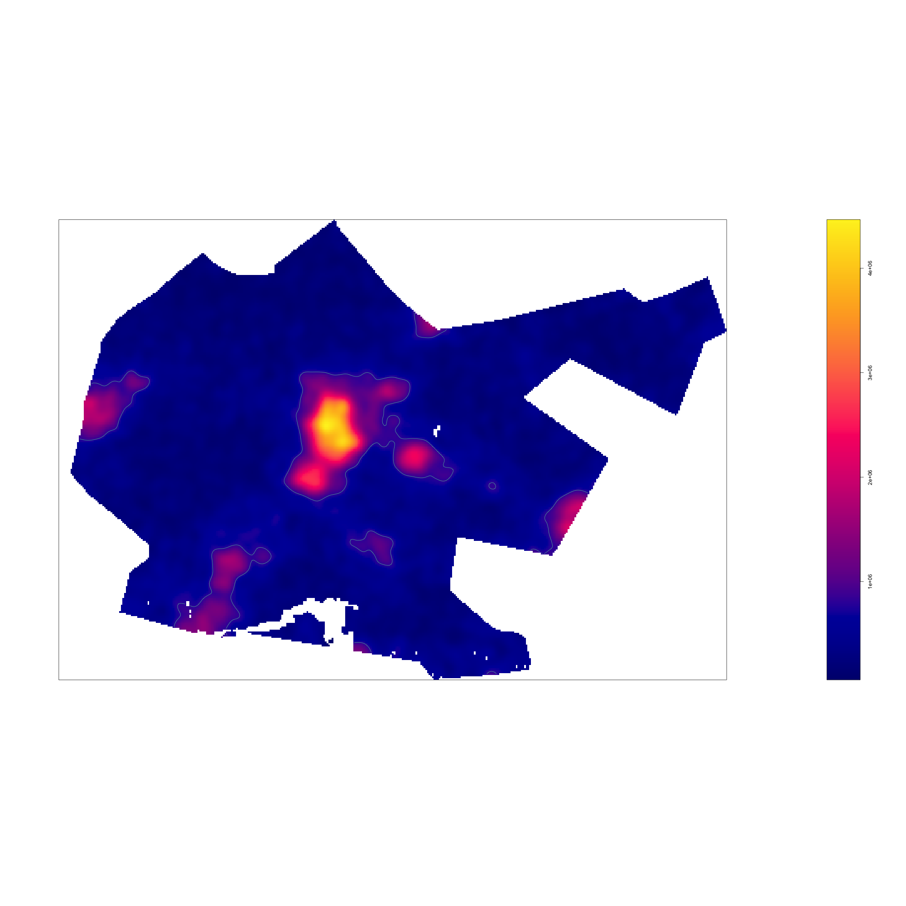
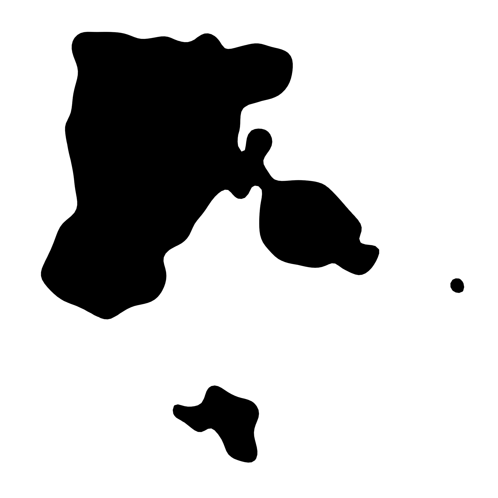
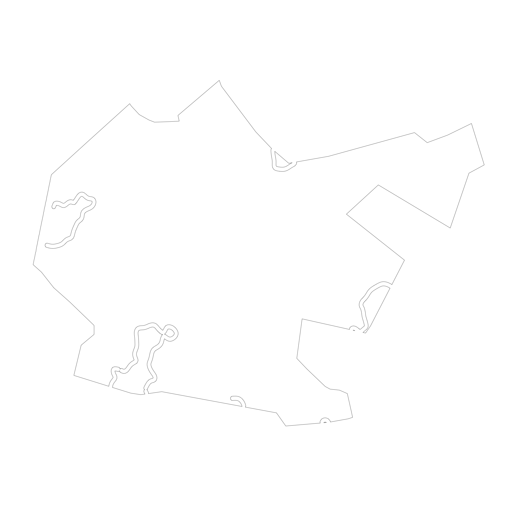
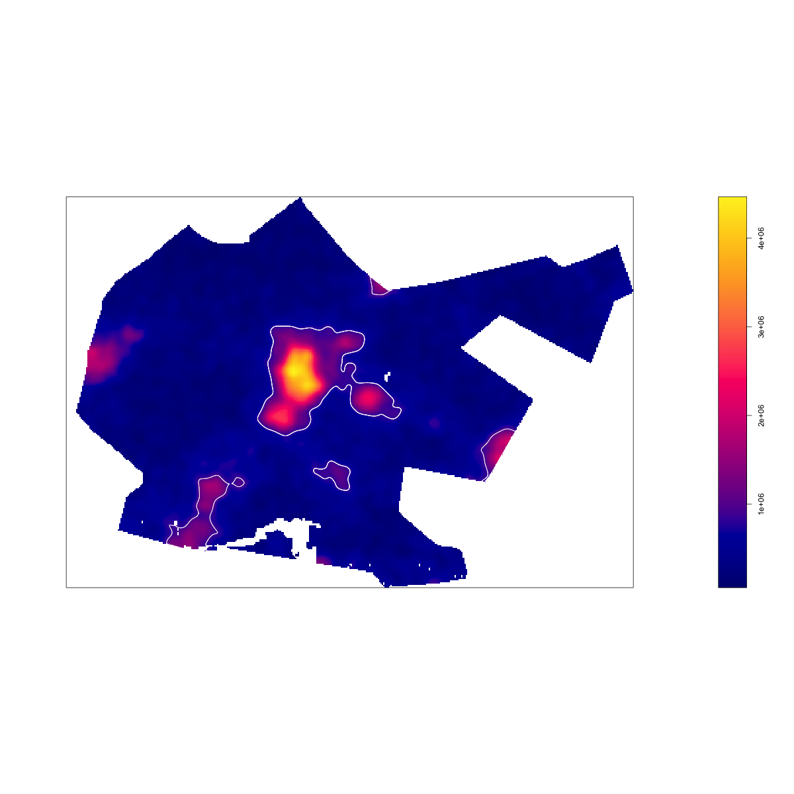
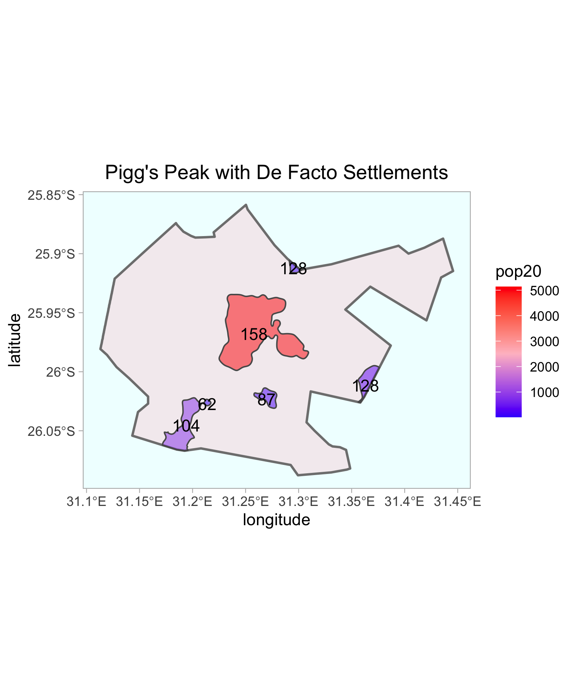
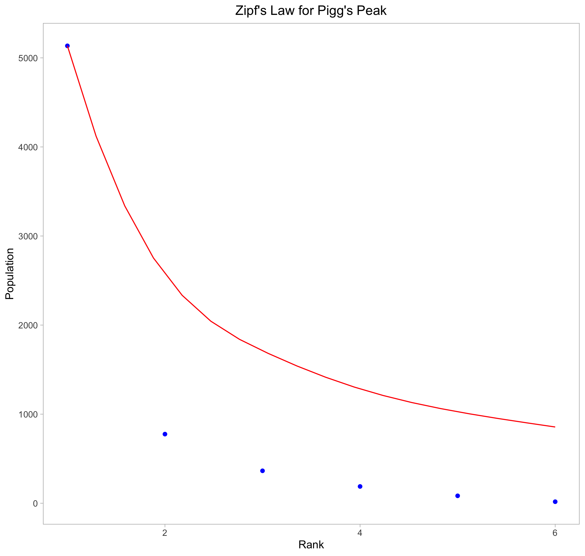

# Part 1.b: Creating De Facto Settlements in Pigg's Peak

### Date: 9/7/2020

[Go to Part 1.a.](densitySwaziland.md)  
[Go to Part 2](project1_part2.md)

## Assignment
First, I zoom in on an adm2, specifically Pigg's Peak, by cropping and masking the image.


Then, I use the spatial probablity distribution to find places to put people.

`pigg_adm2_ppp <- rpoint(pop, f = as.im(swz_pop20_adm2), win = win)`

`as.im` converts raster data to a pixel image and then distributes random points according.


With `bw <- bw.ppl(pigg_adm2_ppp)`, I create a probablity density function or kernel density estimation.

Next, I draw initial settlemtns by contouring my image. Here is the density image updated with lines enclosing areas of high density.


Now we look at the inner polygons

and the outer "polygons."


These outer polygons are not closed because we need to intersect them with Pigg's Peak's border. 

```
my_outer_polys <- st_buffer(outside_lines, 0.0014) %>%
  st_difference(pigg_adm2, .) %>%
  st_cast(., "POLYGON")
 ```
 
Now, we see that the polygons mostly close. There are some issues that can't be mitigated by increasing the buffer or reducing the density threshold. For example, some of my the lines in the middle of the figure never intersect the border.


Next, I plot these polygons over the original density image


and filter out outer polygons that have neglible populations.

Repeat and remove inner polygons with negligible populations. 

```
uas <- st_union(inside_polys_filtered, subpolys_filtered)
urban_areas <- st_cast(uas, "POLYGON")
``` 
Then, I join the inner-filtered and outer-filtered polygons to create a group of polygons corresponding to urban areas.


Finally, I recolor the de factor urban area settlements based on population size and list the density for each settlement.


## Stretch Goal
It's interesting to see how our de facto settlements conform to Zipf's law. Zipf's law predicts a correlation between rank and population for our data according to the red line in the image below. This power law was generated by dividing the first population by rank from 1 to 6. Thus, we are plotting expected values. The blue points are our observed measurements of population for each de facto settlement according to the settlement's rank. Rank was generated by ordering the population from greatest to least: `zipf <- urban_areas[order(-urban_areas$pop20),]`.   

An interesting observation is that the populations tend to drop off faster for each settlement, as indicated by the blue points below the red expected value line. 

[Here](scripts/DefactoDescriptionSwaziland.R) is the code.

[Go to Part 1.a.](densitySwaziland.md)  
[Go to Part 2](project1_part2.md)

