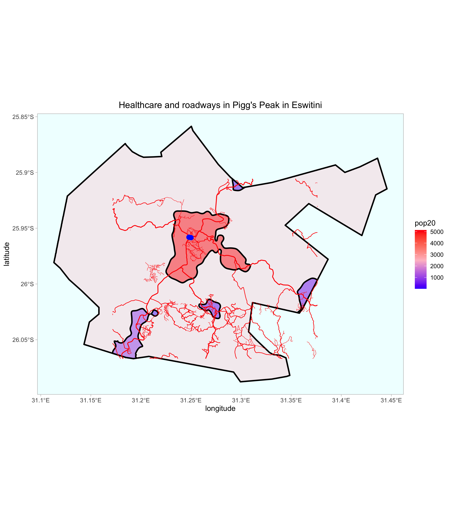

# Adding transportation facilities & health care services

### Date: 9/13/2020

## Assignment
Now we are interested in looking at accessibility of roads and healthcare.

### Roads
First, we pull in roadway data from [HDX](https://data.humdata.org/dataset/hotosm_swz_roads) and crop it to the bounds of Pigg's Peak.
```
LMIC_roads <- read_sf("hotosm_swz_roads_lines_shp/hotosm_swz_roads_lines.shp")
adm2_roads <- st_crop(LMIC_roads, urban_areas)
```
Looking at the data, we see that roads are classified as different types of highways:
- Primary
- Secondary
- Unclassified
- Tertiary
- Residential
- Track
- Service
- Path
Information about highway classification can be found [here](https://wiki.openstreetmap.org/wiki/Key:highway).

I decided to separate my roads into three groups as seen in this code snippet:
```
roads_1 <- adm2_roads %>%
  filter(highway %in% c("primary", "secondary"))

roads_2 <- adm2_roads %>%
  filter(highway %in% c("unclassified", "tertiary"))

roads_3 <- adm2_roads %>%
  filter(highway %in% c("residential", "path"))
```

Here is the plot of roadways in Pigg's Peak.


Notice the de factor boundaries defining settlements are highlights.

### Health Care
Next, we want to plot health care facilities in Pigg's Peak. The open source data can be found [here](https://data.humdata.org/dataset/hotosm_swz_health_facilities). Again, we crop to the bounds of our adm2. 
```
LMIC_health <- read_sf("hotosm_swz_health_facilities_points_shp/hotosm_swz_health_facilities_points.shp")
adm2_health <- st_crop(LMIC_health, pigg_adm2)
```
In the console, we want to see what healthcare options are in the bounds of our adm2. By entering `adm2_health$healthcare`, we learn there are two hospitals in Pigg's Peak. Therefore, we only need to filter `healthcare` by `hospital`.
```
hospital <- adm2_health %>%
  filter(healthcare %in% c("hospital"))
```
Now we can plot our two hospitals with our road data.



