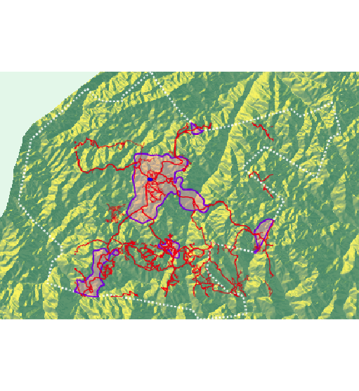
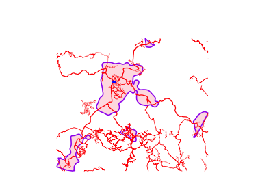
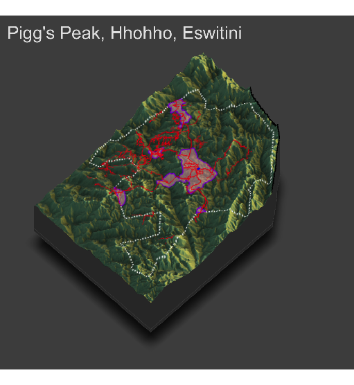

# Part 3: Adding topography

[Go to Part 2](project1_part2.md)  
[Go to Summary](project1summary.md)

### Date: 9/14/2020

## Assignment
In order to understand why people choose to settle where they do, it is helpful to look at the topography of the land. People need access to water and few people want to live on the side of a mountain, so defining the characteristics of the land is helpful to understand the nature of the de facto settlements.

First, I collected data from WorldPop [here](ftp://ftp.worldpop.org.uk/GIS/Covariates/Global_2000_2020/SWZ/Topo/) for Eswitini. Then, I cropped the topography raster data to Pigg's Peak's bounds, and converted the raster to a matrix, whose dimensions were 399x275. Here is the 2D plot of the matrix.

To overlay the roads, healthcare facilities, and de facto settlements, I created a new plot with `ggplot()` at the end of Part 2 that contains accessibility data. Here is the plot:    

Finally, I generated this 3D-rendering of Pigg's Peak in Eswitini with settlement, road, and healthcare information.    

